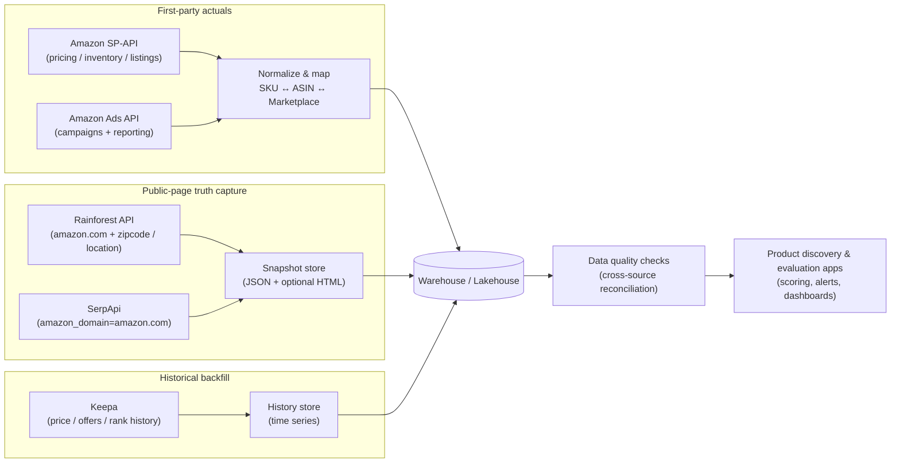

# Most Authentic US Amazon E‑commerce Data Providers

## Document Update History

| Date | Sections Changed | Summary |
|---|---|---|
| 2026-04-22 | All | Initial research report — vendor evaluation for Amazon US data providers |

## Table of Contents

- [Executive Summary](#executive-summary)
- [What Amazon Provides Directly](#what-amazon-provides-directly-and-how-to-use-it-as-the-baseline)
  - [PA-API (deprecated)](#amazon-product-catalog-data-for-affiliates-pa-api-deprecated-and-migration-reality)
  - [SP-API (Selling Partner API)](#amazon-seller-actuals-sp-api-selling-partner-api)
  - [Amazon Ads API](#amazon-advertising-actuals-amazon-ads-api)
  - [Amazon's position on scraping](#amazons-position-on-scraping-and-why-it-matters-to-authenticity)
- [Provider Landscape](#provider-landscape-and-how-this-report-prioritizes-authentic-us-data)
- [Provider-by-Provider Analysis](#provider-by-provider-analysis-with-api-evidence)
  - [Keepa](#keepa)
  - [Rainforest API (Traject Data)](#rainforest-api-traject-data)
  - [SerpApi](#serpapi)
  - [Jungle Scout](#jungle-scout)
  - [Helium 10](#helium-10)
  - [DataHawk](#datahawk)
  - [SellerApp](#sellerapp)
  - [AMZScout](#amzscout)
  - [Apify](#apify-amazon-scraping-actors)
  - [Bright Data](#bright-data)
  - [Oxylabs](#oxylabs)
  - [ScraperAPI](#scraperapi)
  - [Zyte / ScrapingBee / Import.io / Octoparse / Scrape.do](#zyte-scrapingbee-importio-octoparse-scrapedo-scraping-infrastructure)
  - [DataWeave](#dataweave-enterprise-digital-commerce-intelligence)
  - [Rithum / 1010data](#rithum-channeladvisor-and-1010data-downstream-platforms)
- [User Review Synthesis and Authenticity Risk Ratings](#user-review-synthesis-and-authenticity-risk-ratings)
- [Recommendations, Comparison Matrix, and Integration Plan](#recommendations-comparison-matrix-and-integration-plan)
- [Primary Source Link Index](#primary-source-link-index)

---

## Executive summary

“Authentic” Amazon US data is best understood as **data that is (a) first‑party from Amazon’s official APIs, or (b) a verifiable capture of what a real shopper sees on Amazon.com at a given time/location**, with clear metadata, low latency, and the ability to audit raw page evidence when needed. citeturn16search0turn23view0turn50view2

Three findings drive the recommendation:

1. **Amazon first‑party APIs are the only true source of record—but they are scope‑limited and gated.** The entity["company","Amazon","ecommerce company"] Selling Partner API (SP‑API) and Amazon Ads API can provide highly reliable “actuals” (e.g., your own inventory/prices, advertising performance), but only for authorized seller/vendor/advertiser accounts, and access is constrained by roles/policies. citeturn16search2turn16search13turn42search20turn8search23

2. **Public-page Amazon intelligence data is almost always scrape/crawl-derived or model-estimated.** When a provider estimates sales or keyword volumes, authenticity becomes “best-effort inferred,” not a ground truth. citeturn46view0turn17view1

3. **The highest-authenticity third‑party options are those that (a) directly crawl Amazon pages with locale controls and (b) expose the evidence trail (request metadata, raw HTML, timestamps), plus a dedicated historical tracker for price/BSR.** citeturn23view0turn25view0turn50view2turn20view0

### Top recommendations for most authentic Amazon US marketplace data

If you mean **“most authentic (closest to what Amazon.com shows) third‑party data for the US marketplace”**, the best-supported top three are:

- **Keepa** for **historical** price/offer/Buy Box and sales-rank signals at scale (time series and history are its core differentiator). citeturn20view1turn20view0  
- **Rainforest API** (Traject Data) for **on-demand Amazon.com page captures** with **US customer location/ZIP controls** and optional raw HTML for audit. citeturn23view0turn25view0turn47search1  
- **SerpApi** for **structured Amazon.com product/search page extraction** with explicit `amazon_domain=amazon.com`, response metadata and raw HTML files for traceability. citeturn50view2turn38view3turn47search2turn47search14

If you also need **“actuals” for your own seller account** (inventory, your offer pricing, listings updates, brand analytics reports, ads performance), no third‑party can beat a **direct integration with Amazon SP‑API + Amazon Ads API**; the recommended third‑party trio above should be considered **complementary** to first‑party APIs, not a replacement. citeturn42search2turn42search1turn42search3turn8search0turn8search1

## What Amazon provides directly and how to use it as the baseline

A practical way to compare third‑party providers is to start from **Amazon’s official surface area** and treat everything else as either (1) enrichment, (2) historical backfill, or (3) competitive intelligence via public pages.

### Amazon product catalog data for affiliates: PA‑API (deprecated) and migration reality

Amazon’s Product Advertising API (PA‑API) exposes product catalog content for affiliates (e.g., browsing nodes, images, item info, offers), via operations like `GetItems`. The `GetItems` operation explicitly supports resources such as `BrowseNodeInfo`, `Images`, `ItemInfo`, `Offers`, and `OffersV2`. citeturn7search2turn0search0

However, **PA‑API is in shutdown mode**: Amazon’s own documentation states **PA‑API “will be deprecated on April 30th, 2026”** and that the PA‑API documentation site is no longer maintained; Amazon directs developers to migrate to the Creators API. citeturn7search0turn45search2  
Implication: PA‑API can still be used as a *schema baseline for “what Amazon might expose to non-sellers”*, but you should not design a long-lived system expecting PA‑API stability past April 2026. citeturn7search0

### Amazon seller “actuals”: SP‑API (Selling Partner API)

For authenticity of *your own account data*, SP‑API is the gold standard. Examples of directly relevant SP‑API capabilities include:

- **Offer pricing (your listings)** via Product Pricing API operations like `getPricing` (pricing info for a seller’s offer listings by SKU/ASIN). citeturn42search1turn42search5  
- **FBA inventory summaries** via `getInventorySummaries`. citeturn42search2turn42search6  
- **Listings updates** via Listings Items API operations like `putListingsItem`. citeturn42search3turn42search19  

SP‑API access is gated: Amazon’s own “private developer” onboarding states only **Professional Selling Accounts** can register for SP‑API private apps. citeturn16search13  
Access is also controlled by **roles** to protect sensitive data. citeturn42search20  
Finally, Amazon publishes SP‑API policy artifacts (Data Protection Policy / Acceptable Use Policy / Solution Provider Agreement) and expects developers to comply. citeturn16search2turn16search24

### Amazon advertising “actuals”: Amazon Ads API

For ads performance and campaign management, Amazon provides the Amazon Ads API. Amazon’s documentation describes version 3 reporting (asynchronous report workflows) and provides OpenAPI specifications for Sponsored Products campaign management. citeturn8search0turn8search1turn8search4  
Amazon also documents token behavior (access tokens valid for 60 minutes) and rate limiting concepts. citeturn8search17turn8search6

### Amazon’s position on scraping and why it matters to “authenticity”

Even if scraped data looks like the site, it is not “official.” Amazon’s Conditions of Use explicitly restrict “data mining, robots, or similar data gathering and extraction tools.” citeturn16search0  
This affects risk assessment for any provider that collects data by scraping Amazon.com pages without an Amazon partnership, even if the resulting dataset appears accurate. citeturn16search0turn23view0turn50view2

## Provider landscape and how this report prioritizes “authentic US data”

This evaluation prioritizes **Amazon.com (US marketplace) authenticity** using five lenses:

- **Provenance**: official API vs. crawl/scrape vs. modeled estimates. citeturn46view0turn25view0turn42search1  
- **Auditability**: presence of request metadata, timestamps, and raw HTML evidence to reproduce/verify. citeturn25view0turn50view2turn10search0  
- **US localization controls**: Amazon.com domain selection and (ideally) US ZIP/location targeting. citeturn23view0turn50view2  
- **Coverage match to Amazon’s native attributes**: catalog + offers + reviews + promotions + rank + ads + inventory. citeturn7search2turn42search2turn8search0turn25view0turn50view0  
- **Operational reliability signals**: published rate limits, uptime statements, and recurring review themes (accuracy/latency/support). citeturn19view0turn47search2turn6search13  

### Prioritized roster of major Amazon US–relevant providers covered

The following are the main “provider types” you will see in the market:

- **Historical market trackers**: entity["company","Keepa","amazon price history tracker"] (strong time-series data for prices/offers/rank/review count depending on plan usage). citeturn20view1turn20view0  
- **On-demand Amazon page extraction APIs**: entity["company","Traject Data","ecommerce data provider"] (Rainforest API) and entity["company","SerpApi","search scraping api company"] (structured extraction with `amazon_domain`). citeturn23view0turn25view0turn50view2turn38view3  
- **Amazon seller intelligence suites (often with estimates)**: entity["company","Helium 10","amazon seller software suite"], entity["company","Jungle Scout","amazon seller software suite"], entity["company","DataHawk","ecommerce analytics company"], entity["company","SellerApp","amazon seller software company"], entity["company","AMZScout","amazon seller tools company"]. citeturn46view0turn17view1turn19view0turn39view1turn4search17  
- **Scraping platforms and data infrastructure (generic, Amazon-capable)**: entity["company","Apify","web scraping platform company"], entity["company","Bright Data","web data platform company"], entity["company","Oxylabs","web scraping company"], entity["company","ScraperAPI","web scraping api company"], entity["company","Zyte","web scraping company"], entity["company","ScrapingBee","web scraping api company"], entity["company","Import.io","web data extraction company"], entity["company","Octoparse","web scraping platform company"], plus Amazon-focused plugins like entity["company","Scrape.do","web scraping api company"]. citeturn41view2turn10search0turn9search0turn9search5turn9search10turn3search0turn11search9turn11search0turn9search17  
- **Enterprise commerce operations / integration tooling**: entity["company","Rithum","commerce operations platform"] (ChannelAdvisor lineage; strong for your omni-channel catalog/order/inventory operations, not competitive Amazon page truth). citeturn13search15turn13search20  
- **Analytics platforms that can host/serve Amazon datasets**: entity["company","1010data","analytics platform company"] (APIs for querying their platform—useful downstream, not an Amazon-specific collector). citeturn5search1turn5search13  

Scope note: This report is US-focused (Amazon.com). Where a provider supports multiple marketplaces, the analysis emphasizes whether **Amazon.com + US-localization** are supported. citeturn23view0turn50view2turn17view0  
Country entity reference for context: entity["country","United States","country"].

## Provider-by-provider analysis with API evidence

This section summarizes each provider against the requested dimensions: overview, coverage, freshness, collection method, pricing, and documented endpoints/sample attributes. If the vendor does not publicly document an API or a specific attribute, it is marked as unspecified.

### Keepa

**Overview**: Keepa positions itself as an Amazon price tracker with very large coverage (“tracks over 5 billion Amazon products”). citeturn20view1  

**Data coverage (not exhaustive)**: Keepa’s API client documentation shows product queries returning structured product objects with rich history options including price history types, sales rank history, offer counts, rating history, and review count history; it also references buy box price history and buy box seller history when enabled through parameters. citeturn20view0turn22search2  

**Freshness/latency controls**: Keepa’s API method docs expose an `update` parameter that can force a database refresh (including “live data” behavior), and a `history` flag to include or exclude time series; `days` and `only_live_offers` can limit historical payload volume for performance. citeturn20view0turn22search2  

**Collection method**: Implicitly crawl-based: Keepa “constantly scans” is commonly described in Keepa client/library materials and official backend code references show a `/product` request path and parameters consistent with a crawler-backed dataset. citeturn22search2turn20view0  

**Pricing model**: Keepa’s public-facing pricing is hard to cite from an official, non-JS page in this environment. The Keepa client documentation describes a token-based subscription model where plans differ by “tokens generated per minute” and unused tokens expire after one hour. citeturn47search9  
(Official Keepa pricing page appears to require JavaScript; treat exact euro tier values from third-party pages as non-primary unless you validate them manually in-browser.) citeturn47search9  

**API endpoints and sample attributes (documented evidence)**:  
Keepa backend request code shows `path = "product"` and parameters like `asin`, `domain`, `offers`, `statsStartDate/endDate`, `buybox`, `update`, `history`, `rating`, etc. citeturn22search2  
The Keepa client docs enumerate fields like `SALES` (sales rank history), `COUNT_REVIEWS`, `RATING`, `BUY_BOX_SHIPPING`, and various price/offer count histories. citeturn20view0  

**Authenticity/reliability concerns**: Community discussions report that some derived/limited signals (e.g., stock levels inferred from offers) may diverge from reality in edge cases. citeturn15search0

### Rainforest API (Traject Data)

**Overview**: Rainforest API is a product data API focused on Amazon and other retailers, with a unified `/request` endpoint and a type system (`type=product`, `type=offers`, `type=reviews`, `type=search`, etc.). citeturn23view0  

**Data coverage**: Official docs list many request types: product pages, offers, reviews, search, bestsellers, category, seller profile/feedback/products, Q&A, autocomplete, store pages, and more. citeturn23view0  

**US authenticity controls**: The docs include `amazon_domain="amazon.com"` plus **`customer_location`** and **`customer_zipcode`**, explicitly framed as a way to see how a product appears for different customer locations/ZIPs (useful for US-localized experiences like Amazon Fresh). citeturn23view0  

**Freshness/latency**: Responses include request metadata (created/processed timestamps and “total time taken”) in examples; the API can also optionally return raw HTML (`include_html=true`) for auditability at the cost of larger result sets. citeturn23view0turn25view0  

**Collection method**: On-demand scraping/capture of Amazon pages, returning structured JSON and optionally HTML; the “offers” endpoint explicitly states it retrieves seller offers from the offers listing popup and structures them into an `offers` array with seller and delivery fields. citeturn25view0  

**Pricing model**: Traject Data’s pricing page shows tiered monthly plans priced by credits/requests (e.g., starter/production/big data tiers) with included “custom zip/postal codes.” citeturn47search1  

**API endpoints and sample attributes**:  
- Endpoint pattern: GET `/request` with query parameters including `api_key`, `type`, `amazon_domain`, `asin`, etc. citeturn23view0  
- Offers result example includes: product title/asin/rating/reviews, and per-offer fields such as price (currency/value/raw), minimum/maximum order quantity, condition, delivery details (FBA/FBM, countdown, shipping price), seller object (name/id/link/rating totals and % positive), Buy Box winner flag, pagination, and offer filters. citeturn25view0  

**Authenticity/reliability concerns**: Because it is scrape-derived, it inherits Amazon anti-bot volatility and potential ToS risk, even if data is accurate. citeturn16search0turn23view0

### SerpApi

**Overview**: SerpApi provides “Amazon Search API” and “Amazon Product API” engines with a unified SerpApi `/search` endpoint pattern. citeturn47search14turn38view3  

**Data coverage**:  
- Amazon Product API returns a `product_results` object with product identifiers, images, ratings/reviews, badges, variants, pricing, delivery, stock text, and structured subcomponents like prices arrays. citeturn38view0turn38view2turn47search5  
- Amazon Search API returns structured search results (and SerpApi documents the engine endpoint). citeturn47search14  

**US authenticity controls**: The example response includes `"amazon_domain": "amazon.com"` in `search_parameters`, implying explicit Amazon.com targeting. citeturn50view2  

**Freshness/latency and auditability**: Example results show `search_metadata` with timestamps, a `raw_html_file`, and a `total_time_taken` field. citeturn50view2  

**Collection method**: Scrape-and-parse abstraction: SerpApi identifies itself as scraping Amazon pages and returning structured JSON. citeturn47search17turn38view3  

**Pricing model**: SerpApi pricing is published as monthly plans with included searches/month and throughput, and explicitly markets a “U.S. Legal Shield” as part of plans. citeturn47search2  

**API endpoints and sample attributes**:  
- Endpoint: `https://serpapi.com/search?engine=amazon_product`. citeturn38view3turn50view2  
- Sample `product_results` fields include: `asin`, `title`, `brand`, `thumbnails`, `rating`, `reviews`, `price`, `extracted_price`, `stock`, `delivery`, and more. citeturn50view0turn38view2  

**Authenticity/reliability concerns**: Like any scraper, it is exposed to platform enforcement and legal disputes. While the most visible recent litigation concerns Google search scraping, it illustrates the broader legal friction around large-scale scraping businesses. citeturn15news40turn15news41

### Jungle Scout

**Overview**: Jungle Scout offers a seller intelligence suite and a documented public API intended to let customers build custom tools on top of Jungle Scout data. citeturn17view0turn4search16  

**Data coverage**: Jungle Scout’s API endpoint descriptions list six endpoints: keywords-by-ASIN, keywords-by-keyword, historical search volume, product database (includes “latest known values” and last-30-day sales estimates), sales estimates (daily historical estimated units and price over a date range), and share of voice. citeturn17view1turn17view0  

**Freshness/latency**: The API docs emphasize structured responses, pagination, and error codes; per-endpoint freshness is generally described as “current/last known values” plus historical periods (up to 1 year for certain endpoints) rather than real-time page truth. citeturn17view1turn17view0  

**Collection method**: Jungle Scout does not fully disclose raw data collection methods in the API docs; the product positions itself as “Amazon intelligence,” and a significant portion is estimated (e.g., sales estimates). citeturn17view1turn6search9turn6search17  

**Pricing model**: Public API availability is documented; pricing is typically commercial/plan-based (exact API pricing details were not captured in the sources retrieved here). citeturn17view0turn4search16  

**API endpoints and sample attributes**: The docs show REST base URL, auth headers, and response schema where `attributes` includes fields like title and price in product database results; the help center lists endpoint outputs: search volume, PPC bid signals, “sales estimates,” etc. citeturn17view0turn17view1  

**Authenticity/reliability concerns**: G2’s pros/cons page explicitly notes user concerns about “data inaccuracies” particularly around revenue/sales for niche products—this directly impacts authenticity for “estimated sales” fields. citeturn6search13

### Helium 10

**Overview**: Helium 10 is a broad Amazon seller suite (keyword research, product research, operational tools). citeturn6search0turn46view0  

**Data coverage**: Helium 10’s own help center draws a sharp line: some tools’ data (e.g., Profits/Alerts) is derived from “Amazon’s API” and represents “actual Amazon data,” but “all other data” is based on monitoring/parsing raw data and transforming it through AI/ML models into estimates (sales, keyword search volume, rank estimation, etc.). citeturn46view0  

**Freshness/latency**: Helium 10 describes daily monitoring/parsing and modeled outputs rather than real-time guarantees; details are proprietary. citeturn46view0  

**Collection method**: Mixed (Amazon API for certain account-bound tools, plus proprietary crawling/parsing and modeling for competitive signals). citeturn46view0  

**Pricing model and public API**: No public, fully documented Helium 10 data API endpoints were found in the retrieved official sources; the official description emphasizes proprietary methods and does not disclose collection mechanics. citeturn46view0  

**Authenticity/reliability concerns**: Review sources contain both praise for data quality and complaints about unreliability/plan changes; treat these as product satisfaction signals rather than proof of “truthfulness” of estimates. citeturn6search0turn14search0

### DataHawk

**Overview**: DataHawk is positioned as an eCommerce analytics tool for Amazon and Walmart; it offers an API to manage tracking of products/keywords/categories and related metadata. citeturn18search4turn19view0  

**Data coverage**: DataHawk’s docs state its API helps manage “products, keywords, categories, and more,” including tracking/untracking, marketplace integration checks, and tags. It also documents rate limits and that API access is activated via support and becomes a paid add-on beyond testing. citeturn19view0  

**Freshness/latency**: The retrieved docs specify a rate limit (500 calls / 15 minutes) but not explicit “data latency” SLAs for Amazon.com page truth. citeturn19view0  

**Collection method**: Not explicitly disclosed in the retrieved docs; likely a mix of integrations and crawl-based tracking depending on feature. citeturn18search4turn19view0  

**API endpoints**: The API documentation snippet lists endpoints such as `GET/POST/DELETE /v2/{wid}/products` to list/add/remove tracked products. citeturn18search0turn19view0  

**Authenticity concerns**: Without transparent raw-page evidence or explicit first-party sourcing in the captured docs, treat DataHawk as an “analytics layer” rather than a raw truth provider unless you validate fields against Amazon.com/your SP‑API. citeturn19view0

### SellerApp

**Overview**: SellerApp markets “Amazon Seller APIs” including Product APIs, Keyword APIs, Advertising APIs, Vendor Central APIs, and provides example requests/responses. citeturn39view1  

**Data coverage**: SellerApp’s Product Details API example response includes `product_attributes` (ASIN, title, image URLs, brand, category tree), BSR list, pricing details, fee details (referral/FBA fees), and “product_potential” with sales and revenue estimate ranges, plus ratings counts. citeturn39view1  

**Freshness/latency**: The example request includes `realtime_data=1` and `geo=us`, implying US-scoped retrieval and a “real-time” option, but no explicit SLA was captured here. citeturn39view1  

**Collection method**: Not fully described in the captured page; the presence of estimates indicates modeled components. citeturn39view1  

**API endpoints and sample attributes**: Example request: `https://api.sellerapp.com/sellmetricsv2/products?...&geo=us&productIds=<ASIN>` and response includes the fields above. citeturn39view1  

**Authenticity concerns**: Because it mixes “realtime_data” and “product_potential” estimates, you should treat SellerApp as a hybrid: strong for convenience, but validate “potential/estimate” metrics against SP‑API actuals where possible. citeturn39view1turn42search2

### AMZScout

**Overview**: AMZScout is an Amazon seller tooling product; public API documentation was not found in the retrieved sources, but third-party review ecosystems exist. citeturn4search17  

**Authenticity concerns**: Without a documented data API schema, it is difficult to audit “authenticity” beyond UI-level claims; treat as a UI tool unless you secure a contractual data feed or API. citeturn4search17  

### Apify (Amazon scraping Actors)

**Overview**: Apify is a scraping platform; in its store it hosts Amazon-specific “Actors” (scrapers). citeturn41view2turn40search8  

**Data coverage**: The “Free Amazon Product Scraper” Actor explicitly describes scraping Amazon without Amazon’s API and provides sample output including fields: title, URL, ASIN, in-stock boolean/text, brand, price/list price, star rating breakdown, reviews count, answered questions, breadcrumbs, images, and feature bullets. citeturn41view2  

**Collection method**: Web scraping with anti-blocking infrastructure; Apify explicitly calls it an “Unofficial API.” citeturn41view0turn41view2  

**API endpoints**: Apify’s platform API supports running an Actor and retrieving dataset items via endpoints like `POST /v2/acts/:actorId/run-sync-get-dataset-items`. citeturn40search2turn40search8  

**Pricing model**: Actor-level pricing can be per results; the example Actor page lists a price per 1,000 results. citeturn41view0  

**Authenticity concerns**: Strong for “what the page shows,” weaker for historical continuity and sensitive fields (Buy Box rotation, long-term offer history) unless you repeatedly scrape and build your own history store. citeturn41view2turn20view0

### Bright Data

**Overview**: Bright Data positions itself as a web data platform offering (a) unblocking/scraping APIs and (b) marketplace datasets. citeturn10search0turn10search2  

**Data coverage**: Bright Data’s Amazon dataset marketing pages list product fields such as title, seller name, brand, description, price/currency, availability, and review counts, with options for refresh cadence (daily/weekly/monthly/custom). citeturn10search2turn10search13  

**Collection method and audit**: Web Unlocker API handles rotation/anti-bot/CAPTCHA and returns HTML or JSON. citeturn10search0turn10search7  

**Pricing model**: Dataset marketplace pricing is published (e.g., starting at a per-1K-record rate) and the Amazon datasets page advertises a “$250/100K records” type framing. citeturn10search6turn10search2  

**API endpoints**: Bright Data documents Web Unlocker and other scraper APIs; dataset “Dictionary” views exist (field listings), but a per-field schema for the Amazon product dataset was not fully captured from the sources retrieved here. citeturn10search0turn10search9  

**Authenticity concerns**: Bright Data can be highly authentic if you buy datasets with the right freshness window and retain raw evidence or reproducibility; but you must validate sampling/coverage bias and ensure compliance constraints for Amazon.com scraping. citeturn16search0turn10search6  

### Oxylabs

**Overview**: Oxylabs provides an Amazon “target” under its Web Scraper API, with dedicated parsers for sources like `amazon_product` and `amazon_search`. citeturn9search0turn9search4  

**Coverage**: Oxylabs states you can collect product, pricing, and seller details, and provides ready-made examples. citeturn9search0turn9search8  

**Authenticity concerns**: Similar to Rainforest/SerpApi: high “page truth” potential, but scrape-derived and therefore ToS/anti-bot sensitive. citeturn16search0turn9search0  

### ScraperAPI

**Overview**: ScraperAPI provides both “send URL and get HTML” and structured Amazon endpoints. citeturn9search9turn9search5  

**Coverage**: The Amazon Product API claims to transform an Amazon product page into JSON and “returns all publicly available reviews,” including variants. It also provides an Amazon Offers API endpoint. citeturn9search5turn9search13  

**Authenticity concerns**: Good “public-page truth,” but you should validate that “all publicly available reviews” is practically feasible at scale (pagination limits often exist), and treat as scrape-derived. citeturn9search5turn16search0  

### Zyte, ScrapingBee, Import.io, Octoparse, Scrape.do (scraping infrastructure)

These providers are best viewed as **data-collection infrastructure** rather than Amazon-specific truth sources. They can be used to build your own “authentic” dataset if you implement:

- Browser rendering / anti-block / retries  
- Parsing to structured schema  
- Scheduling to create history  
- Audit logs and raw HTML capture

Evidence of capabilities:

- Zyte positions a “unified web scraping API” and provides detailed API reference docs. citeturn9search10turn9search14  
- ScrapingBee’s documentation describes its scraping API parameters (rendering, proxies, etc.). citeturn3search0  
- Import.io provides web extraction plus “Integrate” endpoints to access extractor runs. citeturn11search5turn11search13  
- Octoparse offers a Data API / OpenAPI to retrieve extracted data and control tasks, and documents rate limits/429 behavior. citeturn11search0turn11search16  
- Scrape.do markets an Amazon Scraper API plugin for structured extraction on Amazon domains. citeturn9search17  

### DataWeave (enterprise digital commerce intelligence)

**Overview and coverage**: DataWeave describes collecting product pages, search results, prices, promotions, stock, images, ratings, and reviews across retailers/regions/categories, with delivery via APIs/feeds/cloud sinks and support for on-demand or scheduled runs. citeturn11search7  

**Authenticity note**: DataWeave is likely compelling for enterprise “digital shelf” programs, but detailed public endpoint schemas were not captured here—plan for a vendor-led data dictionary and contract-verified sampling/latency definitions. citeturn11search7  

### Rithum (ChannelAdvisor) and 1010data (downstream platforms)

- Rithum’s developer docs describe a REST API that supports OData 4.0 concepts like filtering/sorting/paging/selecting/expanding—highly relevant for commerce operations integrations. citeturn13search20turn13search15  
- 1010data documents XML and Dynamic APIs for accessing/querying datasets hosted on their platform—useful once you already have Amazon datasets ingested. citeturn5search1turn5search13turn5search17  

## User review synthesis and authenticity risk ratings

This section aggregates the most recurrent signals from software review sites and community discussions. It focuses on **accuracy, completeness, latency, support, and “truth vs estimate” clarity**.

### Review sources used and trust caveats

Key software review aggregators referenced here include entity["company","G2","software review platform"], entity["company","Capterra","software review platform"], and entity["company","Trustpilot","review platform"], plus community forums such as entity["organization","Reddit","social news platform"] and entity["company","Stack Overflow","developer q&a platform"], and tech discussion boards like entity["organization","Hacker News","tech news forum"]. (A direct, sourced thread sample was available for Reddit in this dataset; multiple additional sources were not exhaustively mined due to platform access variability.) citeturn14search7turn15search0turn15search12turn15search2  

Caveat: **Trustpilot review integrity has faced public scrutiny**, and reporting has documented manipulation attempts and disputes over moderation practices—use it as a sentiment indicator, not a definitive truth metric. citeturn14news38turn14news39  

### Observed themes by provider category

**Estimation-heavy seller suites (Helium 10, Jungle Scout, DataHawk, SellerApp, AMZScout)**  
- Positive themes: breadth of features, usability, and “actionable insights” (often around keywords and workflow). citeturn6search0turn6search2turn6search3turn14search7  
- Authenticity risk: recurring user concerns focus on **sales/revenue estimation accuracy in certain niches**, which is expected because these are not first-party unit-sales feeds. citeturn6search13turn46view0  

**Historical tracker (Keepa)**  
- Positive theme (community): Keepa is widely used for rank/price history and Buy Box context, but users also note edge-case inaccuracies around inferred stock levels. citeturn15search0turn20view0  

**On-demand scraping APIs (Rainforest, SerpApi, ScraperAPI, Oxylabs, etc.)**  
- Strength: strongest “what the page shows” authenticity when they provide raw HTML + structured parsing + precise locale controls (domain/ZIP). citeturn23view0turn25view0turn50view2turn10search0  
- Risk: governed by Amazon anti-bot changes and Amazon’s stated restrictions on automated extraction. citeturn16search0turn23view0  

### Practical authenticity ratings

A simple rubric (A–C) helps operational decisions:

- **A (first-party actuals)**: Amazon SP‑API / Amazon Ads API for your authorized accounts. citeturn42search2turn8search23  
- **B (verifiable public-page truth)**: providers that expose strong audit trails (raw HTML, timestamps) and allow Amazon.com + locale targeting (e.g., SerpApi, Rainforest). citeturn25view0turn50view2  
- **C (modeled estimates)**: suites that provide “sales estimates,” “keyword volumes,” etc., regardless of how good they are; they can be directionally useful but are not ground truth. citeturn46view0turn17view1turn6search13  

## Recommendations, comparison matrix, and integration plan

### Top three providers for the most authentic Amazon.com US data

**Keepa (best for historical truth and time series)**  
Choose Keepa when you need **price history, offer count history, Buy Box history, review count history, and sales-rank (BSR) history** at scale. Its API surface explicitly supports retrieving and constraining historical data and forcing refresh behavior. citeturn20view0turn22search2  

**Rainforest API (best for US-localized on-demand capture with rich offers)**  
Choose Rainforest API when you care about **the exact Amazon.com experience** under a given **US customer ZIP/location**, and you need deep offer-level structures (seller rating totals, fulfillment flags, delivery info). Optional HTML inclusion improves auditability. citeturn23view0turn25view0turn47search1  

**SerpApi (best for structured product/search extraction with evidence links and published plans)**  
Choose SerpApi when you want a **simple scrape-to-JSON abstraction**, explicit Amazon.com domain targeting, and an evidence trail (raw HTML file link and metadata). Published pricing and uptime marketing can also help procurement. citeturn47search2turn50view2turn47search14  

### When no single provider is enough: recommended combos

Because “authenticity” and “coverage” trade off, the most robust systems typically combine:

**Combo for a production-grade “US Amazon truth + history + operations” system**  
- **Amazon SP‑API** for your seller actuals (inventory, your offer pricing, listing updates). citeturn42search2turn42search1turn42search3  
- **Amazon Ads API** for ad performance and campaign management. citeturn8search0turn8search1turn8search23  
- **Keepa** for historical price/BSR/offer dynamics. citeturn20view0turn20view1  
- **Rainforest API or SerpApi** for competitor snapshots, offer pages, and localized public reality checks. citeturn23view0turn25view0turn50view2  

**Combo for “build your own dataset” at massive scale**  
- **Bright Data** (datasets + unblocking) or **Oxylabs/ScraperAPI** (structured Amazon scraper endpoints) to generate scheduled captures, then store raw HTML + parsed JSON internally. citeturn10search0turn10search2turn9search0turn9search5  
- Add **Keepa** to avoid reinventing multi-year price/BSR history. citeturn20view0turn20view1  

### Provider vs attribute comparison matrix

Legend: ✓ = supported/documented, ~ = partial/derived/depends on configuration, — = not the focus / not documented in retrieved sources, ? = unspecified in sources retrieved for this report.

| Provider (ordered by “US authenticity”) | ASIN catalog fields (title/images/attrs) | Current price & availability | Offers / seller list | Buy Box / offer history | Reviews & ratings | BSR / rank history | Sales estimates | Keyword/search data | Inventory (seller actuals) | Raw HTML / audit trail | US localization controls |
|---|---:|---:|---:|---:|---:|---:|---:|---:|---:|---:|---:|
| Amazon SP‑API + Ads API (first‑party baseline) | ✓ | ✓ | ✓ (your offers) | ~ (pricing intelligence varies) | ~ | ~ | — | ~ (reports/brand analytics) | ✓ | — | ✓ (marketplace-scoped endpoints) |
| Keepa | ✓ (basic) | ✓ | ✓ (with offers) | ✓ | ✓ (incl. history when enabled) | ✓ | — | — | — | ~ (structured; not raw HTML) | ✓ (`domain=US`) |
| Rainforest API | ✓ | ✓ | ✓ | ~ (capture-based; build history via scheduling) | ✓ | ~ | ~ (supports “sales estimation” type) | ~ (search/autocomplete types) | — | ✓ (`include_html`) | ✓ (`amazon_domain`, `customer_zipcode`) |
| SerpApi | ✓ | ✓ | ~ (depends on engine components) | ~ (capture-based; build history via scheduling) | ✓ | ~ | — | ✓ (Amazon Search API) | — | ✓ (`raw_html_file`) | ✓ (`amazon_domain=amazon.com`) |
| ScraperAPI (structured endpoints) | ✓ | ✓ | ✓ (offers endpoint) | ~ (build history via scheduling) | ✓ (claims “public reviews”) | ~ | — | — | — | ~ (HTML endpoints) | ✓ (country/domain parameters vary) |
| Oxylabs Web Scraper API (Amazon target) | ✓ | ✓ | ✓ | ~ | ✓ | ~ | — | ✓ (`amazon_search`) | — | ~ | ✓ (“localized content” marketing) |
| Apify Amazon Actors | ✓ | ✓ | ~ | ~ | ✓ | ~ | — | ~ (search-based actors exist) | — | ~ | ✓ (depends on Actor config) |
| Jungle Scout API | ✓ | ~ | — | — | — | ~ | ✓ | ✓ | — | — | ✓ (`marketplace=us`) |
| SellerApp APIs | ✓ | ✓ | ~ | ~ | ✓ | ✓ (current) | ✓ | ✓ (keyword APIs) | — | — | ✓ (`geo=us`) |
| DataHawk API | ~ | ~ | ~ | ~ | ~ | ~ | ~ | ~ | — | — | ~ (marketplace integrations) |
| Helium 10 (suite) | ~ | ~ | ~ | ~ | ~ | ~ | ✓ (est.) | ✓ | ✓ (account tools) | — | ✓ (multi-market) |
| Bright Data (datasets + unlocker) | ✓ | ✓ | ~ | ~ | ✓ | ~ | — | — | — | ✓ (unlocker) | ✓ (geo-locations marketed) |
| DataWeave (enterprise) | ✓ | ✓ | ✓ | ~ | ✓ | ~ | — | ~ | — | ? | ✓ (regions/retailers) |
| Rithum (ChannelAdvisor) | ✓ (your catalog) | ✓ (your prices) | ✓ (your ops) | — | — | — | — | — | ✓ | — | ✓ (channel/marketplace) |
| 1010data | — | — | — | — | — | — | — | — | — | — | — |

Key evidence examples for matrix placement include: Rainforest’s `/request` type list and localization parameters. citeturn23view0 SerpApi’s `amazon_domain` parameter and raw HTML file metadata. citeturn50view2turn38view3 Jungle Scout’s marketplace parameter support (`us`) and endpoint list (sales estimates, keyword endpoints). citeturn17view0turn17view1 SellerApp’s `geo=us` and response fields including BSR and sales estimate. citeturn39view1 Apify’s sample output fields. citeturn41view2 Bright Data’s dataset field examples and unlocker overview. citeturn10search2turn10search0

### Short integration plan for the recommended “best authenticity” combo

A durable architecture treats Amazon data as **multi-source, each source with explicit truth class**:

- **Truth class A (first-party)**: ingest SP‑API + Ads API into a normalized schema keyed by (seller_id, marketplace_id, sku/asin, timestamp). citeturn42search2turn8search0  
- **Truth class B (page truth snapshots)**: ingest Rainforest API and/or SerpApi captures keyed by (asin, amazon_domain, customer_zipcode/location, capture_timestamp). Preserve request metadata and raw HTML pointers where available. citeturn23view0turn25view0turn50view2  
- **Truth class C (history + long lookback)**: ingest Keepa history keyed by (asin, domain, keepa_time) and materialize daily/hourly aggregates for analytics. citeturn20view0turn22search2  
- **Modeled outputs (clearly labeled)**: if you add Jungle Scout/SellerApp estimates, store them with `is_estimate=true` and keep full provenance (provider, model/version if provided). citeturn17view1turn39view1  



### Companies and projects building Amazon product discovery/evaluation systems

A clear pattern emerges: most “product discovery/evaluation” systems are **thin applications over data acquisition + normalization + scoring**.

- **Jungle Scout API-based custom tools**: Jungle Scout explicitly markets its API as a way to “build custom data tools” and its endpoint set (sales estimates, keyword history/search volume, share of voice) maps directly to product evaluation workflows. citeturn4search16turn17view1  
- **Apify store Actors + AI matching**: Apify’s Amazon scraper Actor provides dataset-ready outputs, and the same page promotes an “AI Product Matcher” for cross-store product matching—an ingredient common in product discovery systems (dedupe, competitor mapping). citeturn41view1turn41view2  
- **Open-source building blocks**:  
  - Amazon’s SP‑API OpenAPI models on GitHub are a foundation for building pipeline clients and data models. citeturn42search10  
  - Community libraries exist for Amazon Ads API integrations in Python. citeturn8search31  
  - Keepa’s published backend request structures (in code) serve as an integration reference for custom market intelligence pipelines. citeturn22search2  

## Primary source link index

Below are direct URLs to key primary/official docs and representative review sources referenced above (URLs shown in code for convenience).

```text
Amazon (official)
- https://developer-docs.amazon.com/sp-api/docs/policies-and-agreements
- https://developer-docs.amazon.com/sp-api/reference/getpricing
- https://developer-docs.amazon.com/sp-api/reference/getinventorysummaries
- https://developer-docs.amazon.com/sp-api/reference/putlistingsitem
- https://advertising.amazon.com/API/docs/en-us/reference/api-overview
- https://advertising.amazon.com/API/docs/en-us/guides/reporting/v3/overview
- https://webservices.amazon.com/paapi5/documentation/  (PA-API deprecation notice)

Keepa
- https://keepaapi.readthedocs.io/en/latest/api_methods.html
- https://github.com/keepacom/api_backend/blob/master/src/main/java/com/keepa/api/backend/structs/Request.java

Rainforest API (Traject Data)
- https://docs.trajectdata.com/rainforestapi/product-data-api/parameters/common
- https://docs.trajectdata.com/rainforestapi/product-data-api/results/offers
- https://trajectdata.com/ecommerce/rainforest-api/  (pricing)

SerpApi
- https://serpapi.com/amazon-product-api
- https://serpapi.com/amazon-search-api
- https://serpapi.com/pricing

Jungle Scout API
- https://developer.junglescout.com/api
- https://support.junglescout.com/hc/en-us/articles/21641823937943-API-Endpoint-Descriptions

SellerApp
- https://www.sellerapp.com/amazon-seller-api.html

Apify
- https://apify.com/junglee/free-amazon-product-scraper
- https://docs.apify.com/api/v2/act-run-sync-get-dataset-items-post

Bright Data
- https://docs.brightdata.com/scraping-automation/web-unlocker/introduction
- https://brightdata.com/products/datasets/amazon
- https://brightdata.com/pricing/datasets

Oxylabs
- https://developers.oxylabs.io/scraping-solutions/web-scraper-api/targets/amazon

ScraperAPI
- https://docs.scraperapi.com/structured-data-endpoints/e-commerce/amazon/amazon-product-api
- https://docs.scraperapi.com/structured-data-endpoints/e-commerce/amazon/amazon-offers-api

Octoparse
- https://dataapi.octoparse.com/DataApi/en-US/

Reviews (representative)
- https://www.g2.com/products/jungle-scout/reviews?qs=pros-and-cons
- https://www.trustpilot.com/review/junglescout.com
- https://www.reddit.com/r/AmazonSeller/comments/syaa5d/keepa_accuracy_issues/
```

