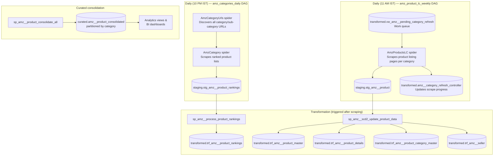
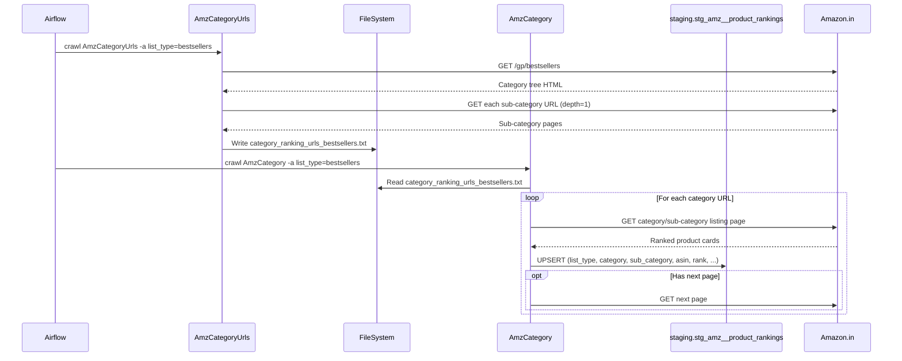
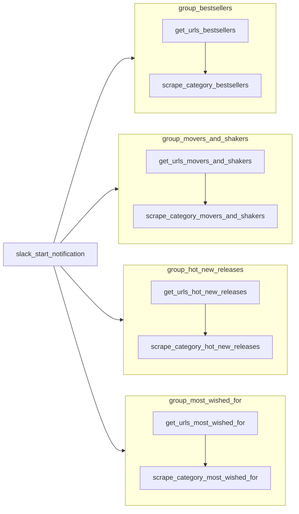
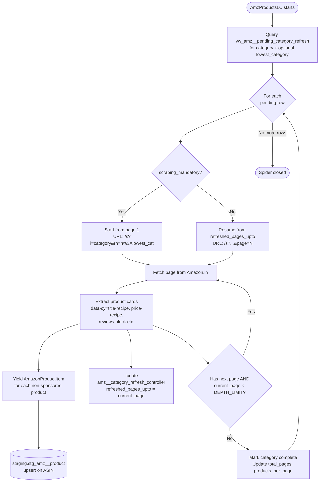
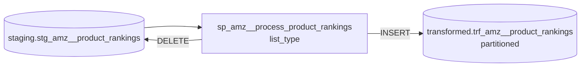
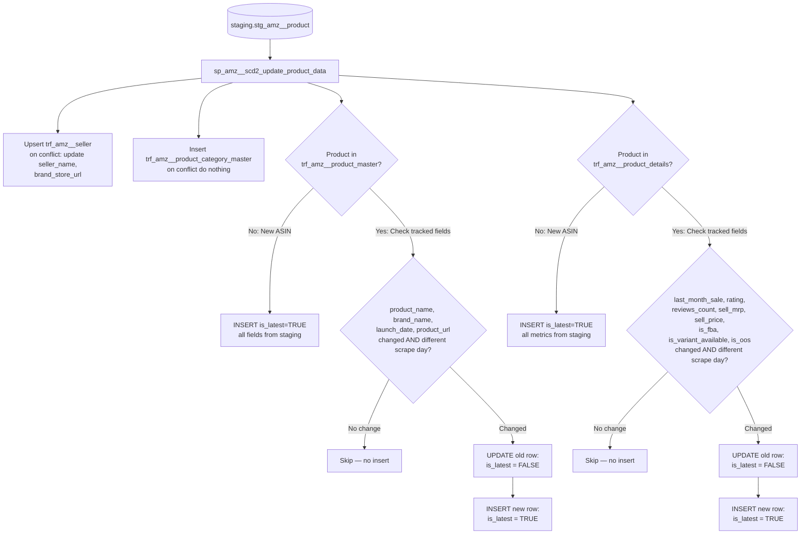
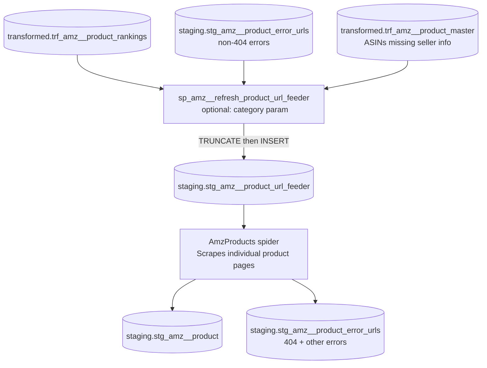
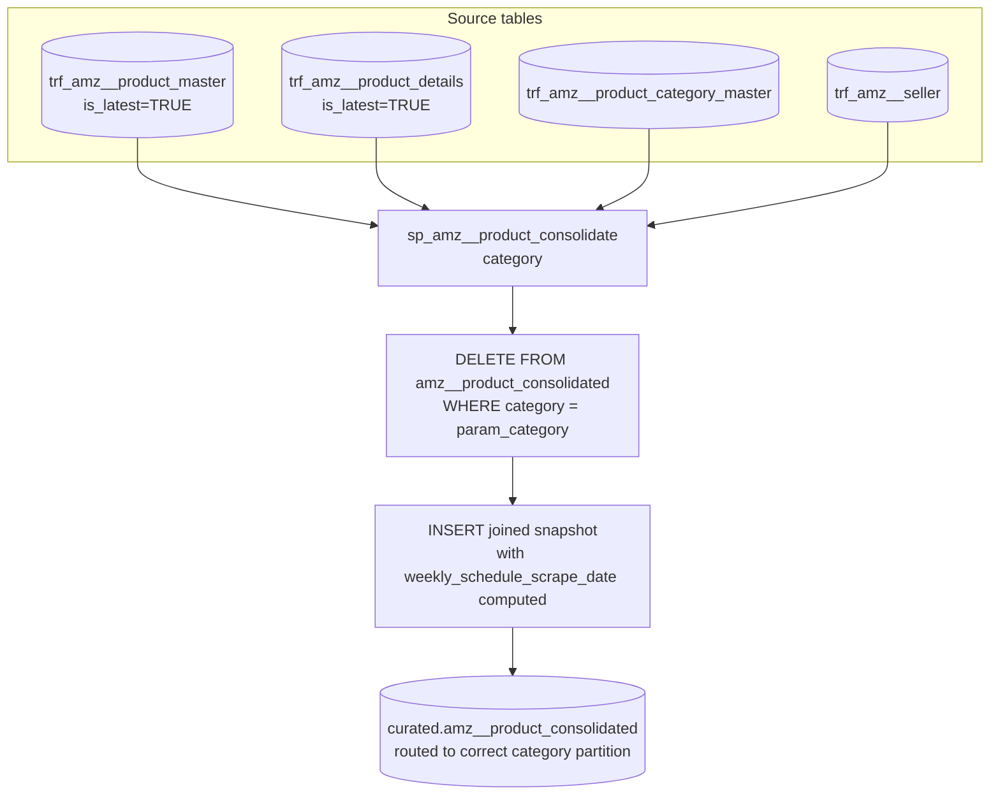
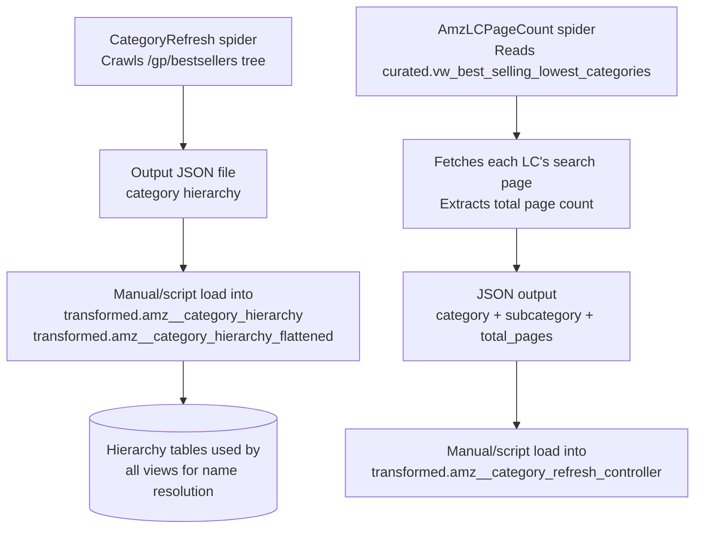
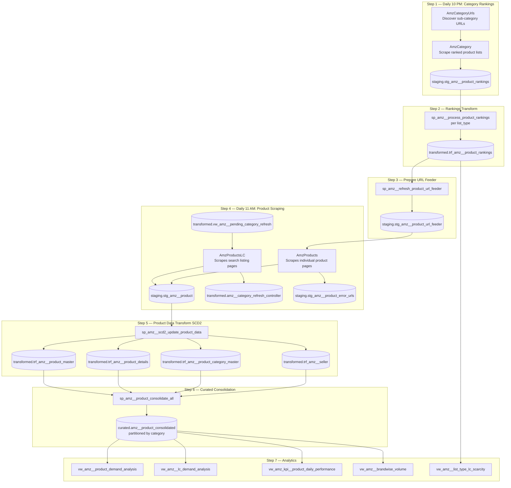

# System Flow — Amazon E-commerce Data Pipeline

> **Last updated:** 2026-04-16

## Document Update History

| Date | Sections Changed | Summary |
|---|---|---|
| 2026-04-16 | All | Initial documentation of Amazon India (amazon.in) scraping pipeline |

## Table of Contents

- [1. High-Level Architecture](#1-high-level-architecture)
- [2. Category Rankings Pipeline (Daily)](#2-category-rankings-pipeline-daily)
- [3. Product Detail Pipeline (Weekly Rotation, Daily Execution)](#3-product-detail-pipeline-weekly-rotation-daily-execution)
- [4. Staging-to-Transformed Transformation](#4-staging-to-transformed-transformation)
- [5. URL Feeder — Bridge to Product Detail Scraping](#5-url-feeder--bridge-to-product-detail-scraping)
- [6. Curated Consolidation](#6-curated-consolidation)
- [7. Category Hierarchy Management](#7-category-hierarchy-management)
- [8. Complete End-to-End Data Flow](#8-complete-end-to-end-data-flow)
- [9. Summary of Spiders](#9-summary-of-spiders)
- [10. Summary of Stored Procedures](#10-summary-of-stored-procedures)

---

This document describes the end-to-end flow of the Amazon India e-commerce data pipeline: from browser-level scraping of Amazon.in, through staging, transformation, and consolidation, to the analyst-facing curated layer. Mermaid diagrams are included at each major stage.

---

## 1. High-Level Architecture

The system has three major concerns:

1. **Category rankings pipeline** — discovers which products appear on Amazon's ranked lists (Best Sellers, Movers & Shakers, etc.) and stores rank history
2. **Product detail pipeline (LC-based)** — scrapes per-product detail pages for all products found in the ranking pipeline, using a weekly category rotation schedule
3. **Curated consolidation** — merges the above into a single wide analyst-facing table, rebuilt per category

All orchestration is done via Apache Airflow with DockerOperator tasks running the Scrapy spider container (`scraper:latest`). All persistent state lives in a local PostgreSQL database (`ecommerce`).



---

## 2. Category Rankings Pipeline (Daily)

**DAG:** `amz_categories_daily`  
**Schedule:** Every day at 10:00 PM IST (`0 22 * * *`)  
**Spider:** `AmzCategoryUrls` → `AmzCategory`

### What it does

Amazon maintains several ranked product lists per category:

| List Type | URL path | What it tracks |
|---|---|---|
| `bestsellers` | `/gp/bestsellers` | Products with highest sales |
| `movers_and_shakers` | `/gp/movers-and-shakers` | Biggest rank gainers in the past 24h |
| `hot_new_releases` | `/gp/new-releases` | Top new & recent products |
| `most_wished_for` | `/gp/most-wished-for` | Most wish-listed products |

For each of the four list types, the DAG runs two tasks sequentially:

1. **`AmzCategoryUrls`** — Starting from the list's root page, recursively crawls all category tree items (up to depth 1) to collect the full set of sub-category URLs. Saves them to a shared file `/app/.urls_to_scrap/category_ranking_urls_{list_type}.txt` on the shared volume.

2. **`AmzCategory`** — Reads the URL file, fetches each category/sub-category page, and extracts all product cards. For each card it records: ASIN, rank, product URL, and (for movers & shakers) the sales_rank text. Follows "next page" pagination. Writes via pipeline to `staging.stg_amz__product_rankings` with an `ON CONFLICT DO NOTHING` upsert.

The four list types run in **parallel task groups** within the DAG.



### Task parallelism



---

## 3. Product Detail Pipeline (Weekly Rotation, Daily Execution)

**DAG:** `amz_product_lc_weekly`  
**Schedule:** Every day at 11:00 AM IST (`0 11 * * *`)  
**Spider:** `AmzProductsLC`

### Category rotation schedule

Different categories are scraped on different days of the week. Each day's run also re-scrapes categories from all previous days of the current week that were not yet fully completed (`refreshed_pages_upto < total_pages`).

| Day (IST weekday) | Categories scraped |
|---|---|
| Monday (0) | `sports` |
| Tuesday (1) | `kitchen`, `hpc` |
| Wednesday (2) | `industrial`, `automotive` |
| Thursday (3) | `grocery`, `garden`, `pet-supplies` |
| Friday (4) | `home-improvement`, `beauty`, `baby`, `shoes`, `office`, `jewelry`, `luggage` |
| Saturday (5) | `electronics` |
| Sunday (6) | Catch-up day — no new categories; re-runs any with `refreshed_pages_upto < total_pages` |

This schedule matches the `weekly_schedule_scrape_date` offset in `sp_amz__product_consolidate`, ensuring each category's data is consolidated for the same relative week slot.

### What `AmzProductsLC` does

The spider reads from `transformed.vw_amz__pending_category_refresh` — the work queue view — to get a list of `(category, lowest_category)` combinations that are either:
- **Due for a fresh scrape** (`scraping_mandatory = TRUE`): starts from page 1
- **Partially complete** (`refreshed_pages_upto < total_pages`): resumes from the last completed page

For each combination it paginates through Amazon's search results (`/s?i={category}&rh=n%3A{lowest_category}&s=popularity-rank`), extracting one `AmazonProductItem` per product card. After each page it updates `transformed.amz__category_refresh_controller` to record progress.



### Fields extracted by `AmzProductsLC`

From the search listing card (partial data — no seller info):

| Field | Source element |
|---|---|
| `asin` | `@data-asin` attribute on `div[role=listitem]` |
| `product_name` | `div[data-cy=title-recipe] a h2 span` |
| `product_url` | `div[data-cy=title-recipe] a @href` |
| `rating` | `data-cy=reviews-ratings-slot span` |
| `reviews_count` | `aria-label="X ratings" span` |
| `last_month_sale` | Reviews block secondary span (e.g. "1K+ bought in past month") |
| `sell_mrp` | `data-cy=price-recipe span:contains("M.R.P")` |
| `sell_price` | `data-cy=price-recipe span.a-price span` |

Fields not available on listing pages (`seller_id`, `seller_name`, `brand_name`, `is_fba`, `is_oos`, `is_variant_available`, `launch_date`, `brand_store_url`) are set to `None`/null and must be supplemented by the `AmzProducts` spider.

---

## 4. Staging-to-Transformed Transformation

After each scrape cycle, two stored procedures process the staging data into the normalised transformed layer.

### 4a. Rankings transformation



`sp_amz__process_product_rankings(list_type)` is called once per list type. It inserts all staging rows for that list type into the partitioned transformed table, then deletes them from staging. The partition routing is handled automatically by PostgreSQL based on the `list_type` value.

### 4b. Product data transformation (SCD2)



**Key SCD2 rules:**
- Changes are only recorded if the scrape date is on a **different calendar day** than the existing latest record (`CAST(scrape_date AS DATE) != CAST(t.scrape_date AS DATE)`). This prevents multiple versions for the same product scraped multiple times in a single day.
- `NULL` values in staging do **not** overwrite existing non-NULL values in the master/details tables (COALESCE logic) — except for `last_month_sale` and `is_oos` which are taken as-is.

---

## 5. URL Feeder — Bridge to Product Detail Scraping

The `stg_amz__product_url_feeder` table acts as a bridge between the ranking pipeline and the product detail scraping pipeline.



The procedure has two variants:
- **`sp_amz__refresh_product_url_feeder()`** — populates the feeder with all ASINs across all categories that are in rankings but not yet scraped as products
- **`sp_amz__refresh_product_url_feeder(category)`** — same but scoped to one category; also adds ASINs already in the product master that are missing seller information (brand_name not in `trf_amz__seller`)

### What `AmzProducts` extracts (from individual product pages)

Unlike `AmzProductsLC` which scrapes listing cards, `AmzProducts` visits each product's detail page and extracts the full set of attributes:

| Field | Source on product page |
|---|---|
| `asin` | Passed via meta (from feeder table) |
| `category` | Breadcrumb first item or Best Sellers Rank span |
| `lowest_category` | Breadcrumb last item or BSR last span |
| `product_name` | `#productTitle` |
| `seller_id` | "Sold by" link href |
| `seller_name` | "Sold by" link text |
| `brand_name` | `#bylineInfo_feature_div` |
| `last_month_sale` | `#social-proofing-faceout-title-tk_bought span` |
| `rating` | `#averageCustomerReviews span` |
| `reviews_count` | Reviews count link |
| `sell_price` | Multiple selectors for various price widget layouts |
| `sell_mrp` | M.R.P. span |
| `launch_date` | "Date First Available" technical details row |
| `is_fba` | "Ships from" attribute in product details |
| `is_variant_available` | `data-totalvariationcount` attribute |
| `is_oos` | "Currently unavailable" or "Temporarily out of stock" text, or absence of "Add to Cart" |
| `brand_store_url` | Byline link href |

---

## 6. Curated Consolidation

After the transformed layer is updated, the curated snapshot is rebuilt for each affected category.



### Weekly schedule date computation

The procedure assigns each row a `weekly_schedule_scrape_date` that normalises the scrape date to a consistent day-of-week anchor for that category. This allows week-over-week trending across categories that are scraped on different days:

```
weekly_schedule_scrape_date = date_trunc('week', pd_scrape_date) + category_offset

Category offsets:
  sports               → +0 days (Sunday/start of week)
  kitchen, hpc         → +1 day  (Monday)
  industrial, automotive → +2 days (Tuesday)
  grocery, garden, pet-supplies → +3 days (Wednesday)
  home-improvement, beauty, baby, shoes, office, jewelry, luggage → +4 days (Thursday)
  electronics          → +5 days (Friday)
  all others           → +0 days (Sunday)
```

---

## 7. Category Hierarchy Management

The category tree is managed separately from the main scraping pipeline and is updated infrequently (when Amazon changes its category structure).



---

## 8. Complete End-to-End Data Flow



---

## 9. Summary of Spiders

| Spider | Triggered by | Reads from | Writes to | Purpose |
|---|---|---|---|---|
| `AmzCategoryUrls` | `amz_categories_daily` DAG | Amazon.in category pages | File: `category_ranking_urls_{list_type}.txt` | Discovers all category/sub-category URLs for a given list type |
| `AmzCategory` | `amz_categories_daily` DAG | URL file + Amazon.in | `staging.stg_amz__product_rankings` | Scrapes ranked product lists (ASIN + rank per category) |
| `AmzProductsLC` | `amz_product_lc_weekly` DAG | `transformed.vw_amz__pending_category_refresh` | `staging.stg_amz__product`, `transformed.amz__category_refresh_controller` | Scrapes product listing pages per lowest-category, extracts partial product data |
| `AmzProducts` | Manual / called after feeder prep | `staging.stg_amz__product_url_feeder` | `staging.stg_amz__product`, `staging.stg_amz__product_error_urls` | Scrapes individual product detail pages for full attribute extraction |
| `AmzLCPageCount` | Manual / one-off | `curated.vw_best_selling_lowest_categories` | JSON output file | Determines total page count for each lowest-category's search results |
| `CategoryRefresh` | Manual / periodic | Amazon.in `/gp/bestsellers` | JSON output file | Crawls full category tree to refresh `amz__category_hierarchy` |

---

## 10. Summary of Stored Procedures

| Procedure | Called by | Action |
|---|---|---|
| `staging.sp_amz__refresh_product_url_feeder()` | Manual / pre-scrape step | Rebuilds the URL feeder with all ASINs needing product detail scraping |
| `staging.sp_amz__refresh_product_url_feeder(category)` | Manual / per-category | Same, scoped to one category; also adds ASINs with missing seller info |
| `transformed.sp_amz__process_product_rankings(list_type)` | Post-rankings scrape | Moves ranking data from staging to transformed, clears staging |
| `transformed.sp_amz__scd2_update_product_data()` | Post-product scrape | SCD2 updates to product master, details, category master, and seller tables |
| `transformed.sp_amz__category_refresh_controller(...)` | `AmzProductsLC` spider (real-time) | Updates scrape progress counters during an active scrape run |
| `curated.sp_amz__product_consolidate(category)` | Post-transform / manual | Rebuilds consolidated snapshot for one category |
| `curated.sp_amz__product_consolidate_all()` | Post-transform / scheduled | Loops over all categories and calls `sp_amz__product_consolidate` for each |
